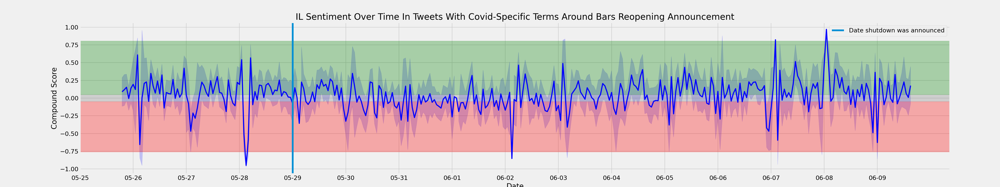

# Project 5 : Covid-Sentiment-Analysis

## Problem Statement:

As the Covid-19 pandemic continues to be the topic of conversation across all dinner tables and of course TV screens in the United States, general sentiment regarding COVID-19 announcements have become a point of interest.

Since most of the response to this pandemic has been mostly regional and state based, we wanted to focus on collecting tweets from several high profile states that have been impacted by the virus, compare how the states reacted to the news of their respective shut down and reopening announcements, and determine if states reacted differently to the announcements.

These states include but are not limited to:
    - New York, New Jersey, Texas, Florida, Ohio, Georgia, Michigan and Illinois.

- Click the links below to access different parts of our project.

## Data Dictionary:

All of the data sources referenced throughout the notebooks lead up to one large csv called `all_states_and_dates_sentiment.csv`, this is not included in the repo because it's about 1 GB in size, but can be rebuilt using `06_combining_data.ipynb` if you'd like to access that csv.

| Variable Name | Description |
|-----------------------------------------------------------------------------------------	|------------------------------	|
|username         | The username of the person who posted tweet.                                                               
|to               | The names of other users the tweet was directed to (blank if no one was mentioned).
|text             | The text included in tweet.
|retweets         | If the post was created by someone else and then reposted by the user.
|favorites        | If someone favorited this tweet.
|replies          | If there were replies to this tweet by other users.
|id               | The number id for the tweet.
|permalink        | Link to the specific post.
|author_id        | The number id for the user.
|date             | The date the tweet was posted.
|hashtags         | Hashtags included in tweet (if any).
|mentions         | The username of other users that are included in the text.
|geo              | These values were all blank because Twitter doesn't share this anymore, but it would be the user's location.
|urls             | Links included in text.
|city             | City the text was scraped in reference to.
|query            | Search words/terms used to find and scrape this text.
|date_range       | Range of dates used in scraping that this text was a part of.
|state            | The state corresponding to the location of scraping.
|month            | The month for which this text was posted.
|day              | The day for which this text was posted.
|month_day_hour   | Date of tweet in a specific date-time format used in analysis but the date and time the tweet was posted.
|is_reopen        | A Boolean value for whether this text comes from the reopening scraping timeframe or shutdown scraping time frame.
|sentiment_analysis | The four scores provided from VADER about the sentiment of the text
|neg_score        | Percentage of how negative a text block was.
|pos_score        | Percentage of how positive a text block was.
|neu_score.       | Percentage of how neutral a text block was.
|compound_score   | The combined score for positive, negative and neutral scores, scored from -1 to 1.

Our second data dictionary comes from [The Covid Tracking Project](https://covidtracking.com/data/api), which aggregates Covid data from a variety of sources including the CDC and state government sites. The api is frequently updated and some features are deprecated, we felt it important to include all of these to see how difficult it is to accurately collect data on Covid. The csv we used is located [here](./data/covid_data_per_state.csv)

| Variable Name | Description |
|----------------------	|--------------------------------------------------	|
|date                     | Date on which data was collected by The COVID Tracking Project.
|dateChecked              | Deprecated. This is an old label for lastUpdateEt.
|death                    | Deaths (confirmed and probable) - Total fatalities with confirmed OR probable COVID-19 case diagnosis (per the expanded CSTE case definition of April 5th, 2020 approved by the CDC). In states where the information is available, it only tracks fatalities with confirmed OR probable COVID-19 case diagnosis where on the death certificate, COVID-19 is listed as an underlying cause of death according to WHO guidelines.
|deathIncrease            | New deaths - Daily increase in death, calculated from the previous day's value. 
|hash                     |A hash for this record
|hospitalized             | Deprecated. Old label for hospitalizedCumulative.
|hospitalizedCumulative   | Cumulative hospitalized/Ever hospitalized - Total number of individuals who have ever been hospitalized with COVID-19. Definitions vary by state / territory. Where possible, we report hospitalizations with confirmed or probable COVID-19 cases per the expanded CSTE case definition of April 5th, 2020 approved by the CDC.
|hospitalizedCurrently  | Currently hospitalized/Now hospitalized - Individuals who are currently hospitalized with COVID-19. Definitions vary by state / territory. Where possible, we report hospitalizations with confirmed or probable COVID-19 cases per the expanded CSTE case definition of April 5th, 2020 approved by the CDC.
|hospitalizedIncrease     | New total hospitalizations - Daily increase in hospitalizedCumulative, calculated from the previous day's value.
|inIcuCumulative          | Cumulative in ICU/Ever in ICU - Total number of individuals who have ever been hospitalized in the Intensive Care Unit with COVID-19. Definitions vary by state / territory. Where possible, we report patients in the ICU with confirmed or probable COVID-19 cases per the expanded CSTE case definition of April 5th, 2020 approved by the CDC.
|inIcuCurrently           | Currently in ICU/Now in ICU - Individuals who are currently hospitalized in the Intensive Care Unit with COVID-19. Definitions vary by state / territory. Where possible, we report patients in the ICU with confirmed or probable COVID-19 cases per the expanded CSTE case definition of April 5th, 2020 approved by the CDC.
|lastModified             | Deprecated. Old label for lastUpdateET.
|negative                 | Negative PCR tests (people) - Total number of unique people with a completed PCR test that returns negative. For states / territories that do not report this number directly, we compute it using one of several methods, depending on which data points the state provides. Due to complex reporting procedures, this number might be mixing units and therefore, at best, it should only be considered an estimate of the number of people with a completed PCR test that return negative.
|negativeIncrease         | Increase in negative computed by subtracting the value of negative for the previous day from the value for negative from the current day.
|onVentilatorCumulative   | Cumulative on ventilator/Ever on ventilator - Total number of individuals who have ever been hospitalized under advanced ventilation with COVID-19. Definitions vary by state / territory. Where possible, we report patients on ventilation with confirmed or probable COVID-19 cases per the expanded CSTE case definition of April 5th, 2020 approved by the CDC.
|onVentilatorCurrently    | Currently on ventilator/Now on ventilator - Individuals who are currently hospitalized under advanced ventilation with COVID-19. Definitions vary by state / territory. Where possible, we report patients on ventilation with confirmed or probable COVID-19 cases per the expanded CSTE case definition of April 5th, 2020 approved by the CDC.
|pending                  | Pending - Total number of viral tests that have not been completed as reported by the state or territory.
|posNeg                   |Deprecated. Computed by adding positive and negative values.
|positive                 | Cases (confirmed plus probable) - Total number of people with confirmed OR probable cases of COVID-19 reported by the state or territory (per the expanded CSTE case definition of April 5th, 2020 approved by the CDC). - A confirmed case is a person who has a positive test result from an FDA approved diagnostic molecular test. - A probable case is a person who has presentable symptoms WITH epidemiological evidence or has BOTH a positive presumptive laboratory test AND also EITHER presentable symptoms OR epidemiological evidence, or who has been issued a death certificate listing COVID-19 as a cause of death or significant contributing cause of death with no confirmatory testing. Epidemiological evidence refers either to close proximity contact with a known case or travel history to an area with high disease incidence. According to the guidelines, FDA approved antibody and antigen tests are considered presumptive laboratory evidence and therefore only one potential part of the evidence required to classify a case as probable.
|positiveIncrease         | New cases - The daily increase in API field positive, which measures Cases (confirmed plus probable) calculated based on the previous day's value.
|recovered                | Recovered - Total number of people that are identified as recovered from COVID-19. States provide very disparate definitions on what constitutes a "recovered" COVID-19 case. Types of "recovered" cases include those who are discharged from hospitals, released from isolation after meeting CDC guidance on symptoms cessation, or those who have not been identified as fatalities after a number of days (30 or more) post disease onset. Specifics vary for each state or territory.
|states                   | States - Only available in national records. The number of states and territories included in the US dataset for this day.
|total                    | Deprecated. Computed by adding positive, negative, and pending values.
|totalTestResults         | Total test results - At the national level, this metric is a summary statistic which—because it sums figures from states reporting tests in test encounters with those reporting tests in specimens and in people—is an aggregate calculation of heterogeneous figures. Therefore, it should be contextualized as, at best, an estimate of national testing performance. - In most states, the totalTestResults field is currently computed by adding positive and negative values because, historically, some states do not report totals, and to work around different reporting cadences for cases and tests. In Colorado, North Dakota, and Rhode Island, where reliable testing encounters figures are available with a complete time series, we directly report those figures in this field. In Massachusetts, where reliable specimens figures are available with a complete time series, we directly report those figures in this field. We are in the process of switching all states over to use directly reported total figures, using a policy of preferring testing encounters, specimens, and people, in that order.
|totalTestResultsIncrease | New tests - Daily increase in totalTestResults, calculated from the previous day's value. This calculation includes all the caveats associated with Total tests/totalTestResults, and we recommend against using it at the state/territory level.
|positivity_rate          | Calculated by us by dividing the values for each row in the 'positive' variable by the values in each corresponding row from the 'total test results' variable. (Not included in original dataframe.)


## Data Collection and Cleaning:

- Our primary method of data collection was though Twitter. Using a python package called GetOldTweets3, we were able to scrape old tweets from Twitter without needing any API keys.

- Tweets were collected around significant dates related to COVID-19 shut downs and re-openings.

- Our cleaning process focused on dropping duplicates, reformatting date/time columns (as these were imperative for our analysis) and removing cities with irrelevant data.  

## Feature Selection:

Scraping Twitter meant deciding which terms to include in our state queries.  While we did not want to rely solely on tweets mentioning Covid-19 to measure general statewide sentiment, we did not want to model the noise by including too many unremarkable opinions. Adding terms that indicated a baseline involvement in current affairs (e.g. Lansing or Whitmer for Michigan) allowed us to gather more insightful and needle-moving tweets.


## EDA:

### Overall findings regarding Shutdown/reopening announcements:
***- For most states, tweet activity trended downward in window of time we looked at (approx two weeks surrounding shutdown/reopening announcements).***

***- Major cities tended to tweet substantially more than other locations.***





## Vader Sentiment Analysis:
- What is Sentiment Analysis?
    - A part of Natural Language Processing (NLP) that identifies the general opinion of text.

- Why is this important?
    - A lot of data these days comes in the form of text and the way people express themselves through text varies
    - The animated processes for gaging sentiment are useful however, it can be quite difficult to analyze figurative language since the meaning/opinion behind the text is usually the opposite of what the text is saying

   - Example: Someone sarcastically says, “I am having a GREAT day!” when they actually are having the opposite. Computers would not be able to interpret this correctly.

**Here's where VADER comes in!**
- VADER which stands for **(Valence Aware Dictionary and sEntiment Reasoner)** is a lexicon and rule-based sentiment analysis tool that is used to analyze sentiments expressed on social media.

- Vader categorizes it's results into 4 scores:
    - Positive—shows how positive the text is (percentage)
    - Negative—shows how negative the text is (percentage)
    - Neutral—shows how neutral the text is (percentage)
    - Composite—combines the three scores into one general/overall score
    - Ranked from -1 to 1


## Conclusions and Insights:

- Regardless of the scale of the dates, local issues generally affect people's sentiments more than national ones.
- Sentiment returns to normal after announcements
- The reopening date had more negative sentiment as compared to the shutdown date
- Between Midnight - 4am, tweets tend to have a higher absolute value for a compound score.


## Next Steps:

**If given more time, we would like conduct the following:**

- Perform a Covid-19 sentiment analysis on all states in the US and compare results.
- Conducting hypothesis testing may also prove to be useful as it may allow us to discover some powerful insights. We would want to know if the variation in our sentiment analysis are statistically significant.
- Connecting other major/ significant events to our data points
- Doing more background on Twitter users.
    - You can read more about it below.
    - https://www.mercurynews.com/2014/08/26/highly-opinionated-people-are-social-media-minority-study-finds/

    - https://www.pewresearch.org/internet/2019/04/24/sizing-up-twitter-users/
    
## Directory Tree

```
│   .gitignore
│   01_twitter-scraping.ipynb
│   02_cleaning.ipynb
│   03_state_twitter_eda.ipynb
│   04_covid_data.ipynb
│   05_sentiment_analysis.ipynb
│   06_combining_data.ipynb
│   07_conclusions.ipynb
│   README.md
│
├───data
│   │   .DS_Store
│   │   covid_data_per_state.csv
│   │   top_words_cvec_il.csv
│   │
│   │
│   ├───Archive
│   │   └───.ipynb_checkpoints
│   │           GA_full-checkpoint.csv
│   │           IL_full-checkpoint.csv
│   │
│   ├───reopening_data
│   │      FL_full_reopen.csv
│   │      GA_full_reopen.csv
│   │      IL_full_reopen.csv
│   │      TX_full_reopen.csv
│   │
│   ├───sentiment_data
│   │   │   FL_reopen_sentiment.csv
│   │   │   FL_shutdown_sentiment.csv
│   │   │   GA_reopen_sentiment.csv
│   │   │   GA_shutdown_sentiment.csv
│   │   │   IL_reopen_sentiment.csv
│   │   │   IL_shutdown_sentiment.csv
│   │   │   MI_reopen_sentiment.csv
│   │   │   MI_shutdown_sentiment.csv
│   │   │   NJ_reopen_sentiment.csv
│   │   │   NJ_shutdown_sentiment.csv
│   │   │   NY_reopen_sentiment.csv
│   │   │   NY_shutdown_sentiment.csv
│   │   │   OH_reopen_sentiment.csv
│   │   │   OH_shutdown_sentiment.csv
│   │   │   TX_reopen_sentiment.csv
│   │   │   TX_shutdown_sentiment.csv
│   │   │
│   │   │
│   │   └───ordered
│   │       │   FL_reopen_sentiment_ordered.csv
│   │       │   FL_shutdown_sentiment_ordered.csv
│   │       │   GA_reopen_sentiment_ordered.csv
│   │       │   GA_shutdown_sentiment_ordered.csv
│   │       │   IL_reopen_sentiment_ordered.csv
│   │       │   IL_shutdown_sentiment_ordered.csv
│   │       │   MI_reopen_sentiment_ordered.csv
│   │       │   MI_shutdown_sentiment_ordered.csv
│   │       │   NJ_reopen_sentiment_ordered.csv
│   │       │   NJ_shutdown_sentiment_ordered.csv
│   │       │   NY_reopen_sentiment_ordered.csv
│   │       │   NY_shutdown_sentiment_ordered.csv
│   │       │   OH_reopen_sentiment_ordered.csv
│   │       │   OH_shutdown_sentiment_ordered.csv
│   │       │   TX_reopen_sentiment_ordered.csv
│   │       │   TX_shutdown_sentiment_ordered.csv
│   │       │
│   │       │
│   │       └───combined
│   │              all_states_and_dates_sentiment.csv
│   │              cleaning_large_set.ipynb
│   │              num_tweets_per_state.csv
│   │
│   └───shutdown_data
│          GA_full_shutdown.csv
│          IL_full_shutdown.csv
│          NJ_full_shutdown.csv
│          TX_full_ignore.csv
│          TX_full_shutdown.csv
│
└───images
       GA_sentiment_reopen.png
       GA_sentiment_shutdown.png
       IL_sentiment_reopen.png
       IL_sentiment_shutdown.png
       top_bottom_cities_GA.png
       top_bottom_cities_IL.png
       tweets_per_day_GA_reopen.png
       tweets_per_day_GA_shutdown.png
       tweets_per_day_IL_reopen.png
       tweets_per_day_IL_shutdown.png
```

Thank you!
