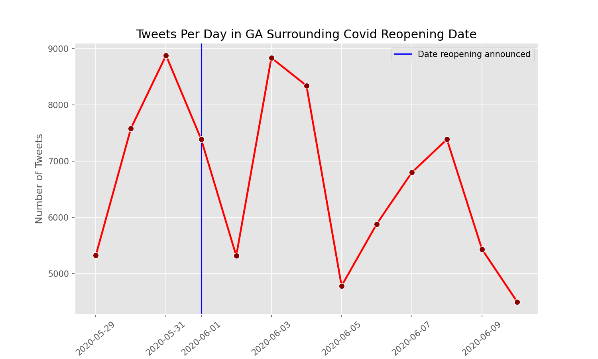
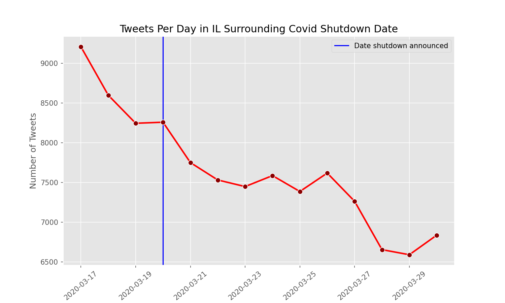
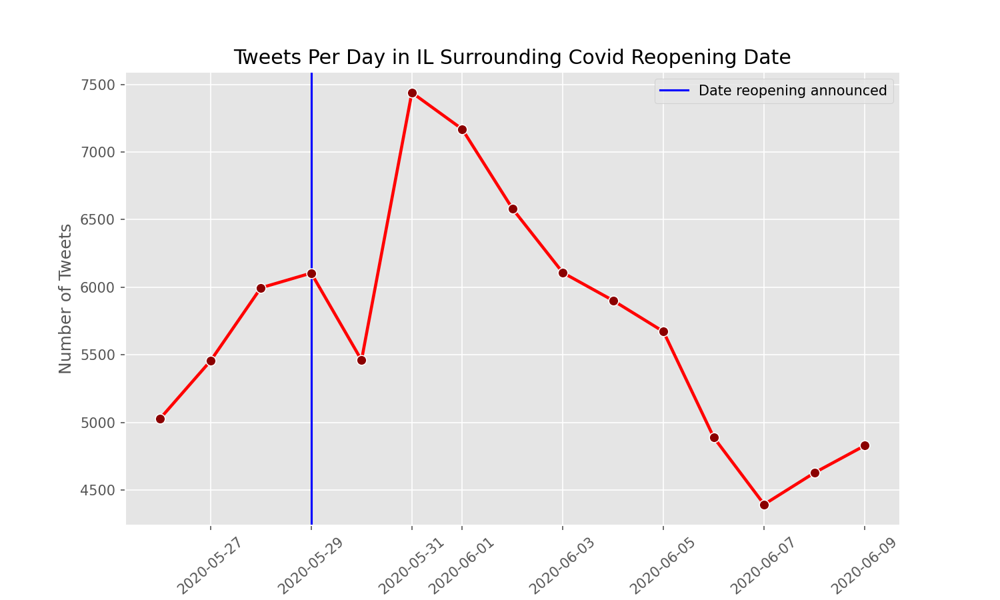
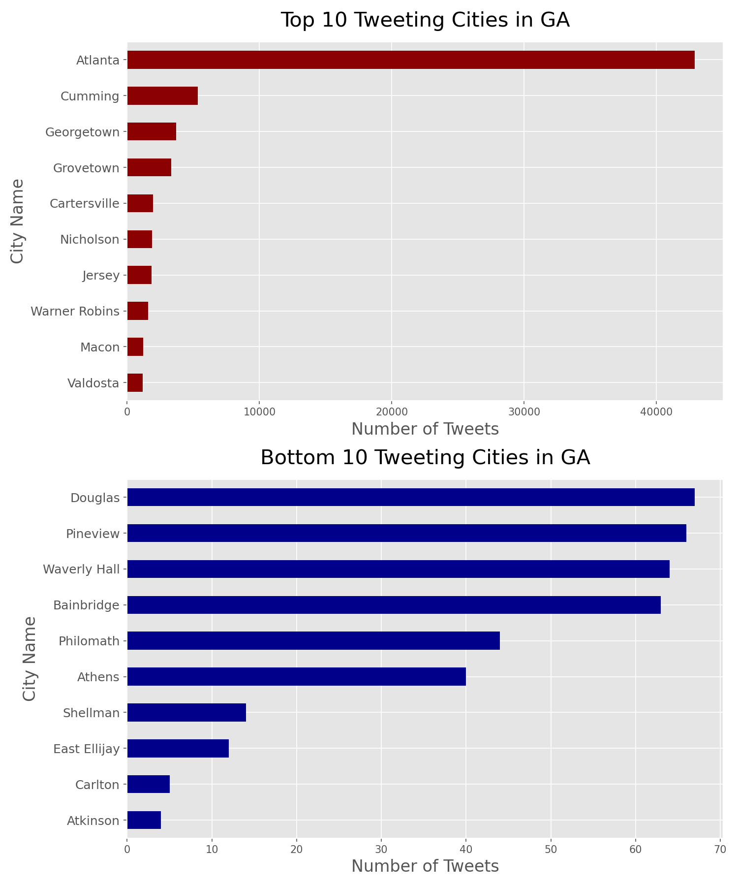
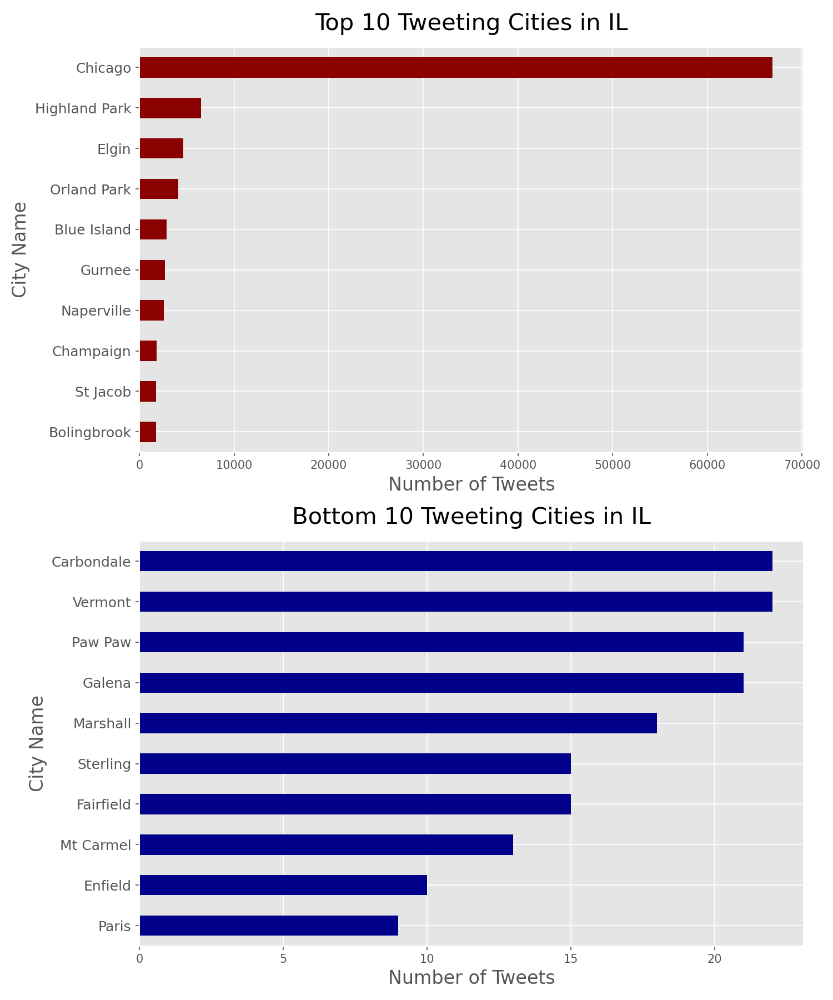
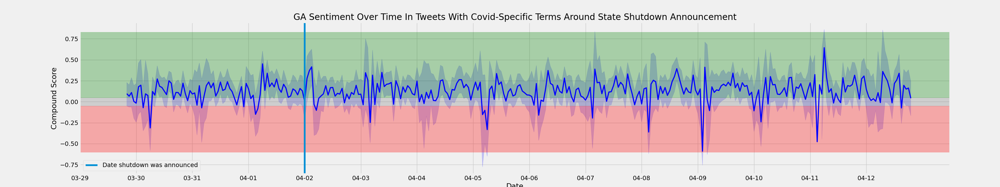
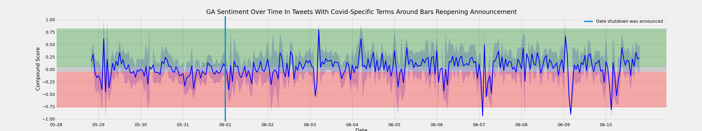
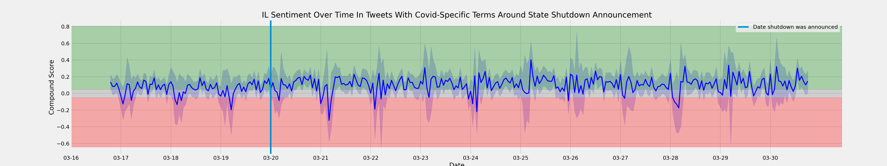

# Project 5 : Covid-Sentiment-Analysis

## Problem Statement:

As the Covid-19 pandemic continues to be the topic of conversation across all dinner tables and of course TV screens in the United States, general sentiment regarding COVID-19 announcements have become a point of interest.

Since most of the response to this pandemic has been mostly regional and state based, we believe it would be important to focus on collecting relevant data from several high profile states that have been impacted by the virus.

These states include but are not limited to:
    - New York, New Jersey, Texas, Florida, Ohio, Georgia, Michigan and Illinois.

## Data Collection and Cleaning:

- Our primary method of data collection was though Twitter. Using a python package called GetOldTweets3, we were able to scrape old tweets from Twitter without needing any API keys.

- Tweets were collected around significant dates related to COVID-19 shut downs and reopenings.

- Our cleaning process focused on dropping duplicates, reformatting date/time columns (as these were imparative for our analysis) and removing cities with irrelevant data.  

## Feature Selection:

Scraping Twitter meant deciding which terms to include in our state queries.  While we did not want to rely solely on tweets mentioning Covid-19 to measure general statewide sentiment, we did not want to model the noise by including too many unremarkable opinions. Adding terms that indicated a baseline involvement in current affairs (e.g. Lansing or Whitmer for Michigan) allowed us to gather more insightful and needle-moving tweets.

## EDA:

### Overall findings regarding Shutdown/reopening annoucements:
***- For most states, tweet activity trended downward in window of time we looked at (approx two weeks surrounding shutdown/reopening announcements).***

***- Major cities tended to tweet substantially more than other locations.***

## Vader Sentiment Analysis:
- What is Sentiment Analysis?
    - A part of Natural Language Processing (NLP) that identifies the general opinion of text.

- Why is this important?
    - A lot of data these days comes in the form of text and the way people express themselves through text varies
    - The animated processes for gaging sentiment are useful however, it can be quite difficult to analyze figurative language since the meaning/opinion behind the text is usually the opposite of what the text is saying

      - Example: Someone sarcastically says, “I am having a GREAT day!” when they actually are having the opposite. Computers would not be able to interpret this correctly

**Here's where VADER comes in!**
- VADER which stands for **(Valence Aware Dictionary and sEntiment Reasoner)** is a lexicon and rule-based sentiment analysis tool that is used to analyze sentiments expressed on social media.

- Vader categorizes it's results into 4 scores:
    - Positive—shows how positive the text is (percentage)
    - Negative—shows how negative the text is (percentage)
    - Neutral—shows how neutral the text is (percentage)
    - Composite—combines the three scores into one general/overall score
    - Ranked from -1 to 1

## Conclusions and Insights:

- Regardless of the scale of the dates, local issues generally affect people's sentiments more than national ones.
- Sentiment returns to normal after annoucement  
- The reopening date had more negative sentiment as compared to the shutdown date
- Between Midnight - 4am, tweets tend to have a higher absoulute value for a compound score.

## Next Steps:

**If given more time, we would like conduct the following:**

- Perfrom a Covid-19 sentiment analysis on all states in the US and compare results.
- Conducting hypothesis testing may also prove to be useful as it may allow us to discover some powerful insights. We would want to know if the variation in our sentiment analysis are statistically significant.
- Connecting other major/ significant events to our data points
- Doing more backgroud on Twitter users.
    - You can read more about it below.
    https://www.mercurynews.com/2014/08/26/highly-opinionated-people-are-social-media-minority-study-finds/

    https://www.pewresearch.org/internet/2019/04/24/sizing-up-twitter-users/

 Thank you!
